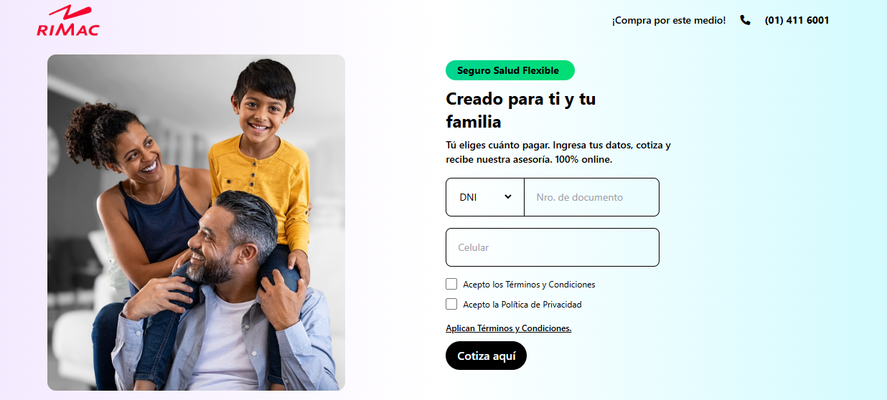
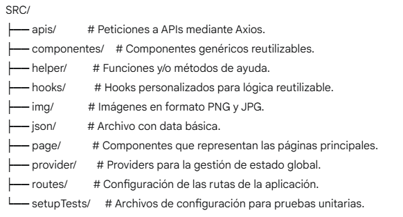
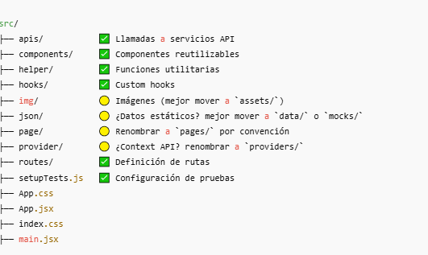

# 🛡️ Proyecto Rímac: Seguros a tu Medida 🚀

Este proyecto es un sistema innovador que te ofrece los mejores planes de seguro personalizados según tu edad y las últimas ofertas del mercado.

[Visitar Proyecto Rímac](https://proyecto-rimac.netlify.app/)

**Características Principales:**

* **Cotización Inteligente:** Un formulario validado te guiará para obtener las ofertas más adecuadas para ti.
* **Resumen Detallado:** Al seleccionar un plan, recibirás un resumen completo con todos los detalles.
* **Adaptabilidad Total:** El sistema está diseñado para funcionar perfectamente en cualquier dispositivo (responsive).
* **Tecnología Moderna:** Creado con **React Vite**, lo que garantiza un desarrollo rápido y eficiente.
* **Seguridad y Validación:** Cuenta con **formularios validados** y **rutas protegidas** para una experiencia segura.
* **Persistencia Inteligente:** Utiliza **localStorage** para una mejor experiencia de usuario.
* **Organización Eficiente:** Implementa **paginación** para una navegación fluida.
* **Estilo Único:** Presenta **estilos y diseños únicos** y atractivos.

---

## 📂 Arquitectura del Proyecto: Estructura por Tipo de Fichero

---

## 📚 Librerías Utilizadas:

* <0xF0><0x9F><0xAA><0xA5> **Font Awesome:** Para iconos vectoriales.
* 🎨 **Tailwind CSS:** Framework de CSS utilitario para un diseño rápido y personalizado.
* 📡 **Axios:** Cliente HTTP basado en promesas para realizar peticiones al servidor.
* ✨ **clsx:** Para manipular cadenas de nombres de clase de forma condicional.
* ⚛️ **react-dom:** Proporciona los métodos específicos del DOM que se utilizarán en el nivel superior para habilitar tu modelo React.
* 🧪 **@testing-library/react:** Utilidades para probar componentes de React de una manera centrada en el usuario.
* 🖋️ **Google Fonts:** Para una tipografía web atractiva.
* 📝 **react-hook-form:** Biblioteca para la gestión y validación de formularios en React.
* 🗺️ **react-router-dom:** Para la navegación y el enrutamiento dentro de la aplicación React.
* 🖼️ **@mui/icons-material:** Biblioteca de iconos de Material Design para React.

---

## ✅ Pruebas Unitarias:

* Implementadas con **@testing-library/react** para asegurar la fiabilidad de los componentes.

---

## ⚙️ Gestión de Estados:

* Se utilizaron los **hooks de React** para el manejo de estados y lógica de componentes: `useState`, `useEffect`, `useContext`.

---

## 🌐 Consumo de API:

* El proyecto consume **dos APIs** principales:
    * Información del usuario.
    * Datos de las ofertas de seguros.

---

## 🎨 Manejo de Estilos:

* **Tailwind CSS** fue la elección para un desarrollo de estilos rápido, flexible y mantenible.

---

## 🔒 Validación de Formularios:

* Se implementó la validación utilizando **react-hook-form** y alertas visuales de **@mui/material**.
* **Tipos de Documento:** Admite **DNI** y **CE**.
* **Validación Numérica:** Los campos de documento deben ser numéricos y tener más de 8 dígitos.
* **Aceptación de Políticas:** Requiere la aceptación de las políticas de privacidad y condiciones, mostrando una alerta en caso contrario.
* **Visualización de Políticas:** Permite visualizar las políticas al hacer clic en los enlaces correspondientes.

---

## 📂 Estructura de Carpetas:

---

## 🏷️ Etiquetas HTML Semántico Utilizadas:

`<article>`, `
`, `<h1>`, `<h2>`, `
`, `<header>`, `<footer>`, `<main>`, `<section>`, ``

---

## 🛠️ Integración Continua:

* El repositorio del proyecto se encuentra en **GitHub**.

---

## ✨ Clean Code:

Se considera que el código es fácil de entender, mantener y modificar gracias a:

* **Nombres Significativos:** Variables, funciones, clases y archivos con nombres claros y descriptivos.
* **Funciones Pequeñas:** Funciones concisas que realizan una única tarea, facilitando su comprensión, prueba y reutilización.
* **Pruebas Unitarias:** Automatización implementada (en los componentes `Footer` y `Header`) para verificar la correcta funcionalidad y facilitar la refactorización.

---

## 🚀 Performance:

Se percibe como una aplicación **rápida, fácil y segura**, con un **diseño responsive y creativo**. Además, cuenta con **acceso a rutas protegidas** y un **sistema de seguridad de rutas** robusto.

---

## ⚡ React Vite:

La utilización de **React Vite** permite un **desarrollo más rápido y eficiente** en comparación con empaquetadores tradicionales. Su servidor de desarrollo ultrarrápido y configuración sencilla se traducen en una mayor productividad y una mejor experiencia para el usuario final.

---

## 📱 Diseño Responsive:

El diseño de la aplicación es **adaptable a cualquier dispositivo**, garantizando una experiencia de usuario óptima en móviles, tablets y escritorios.